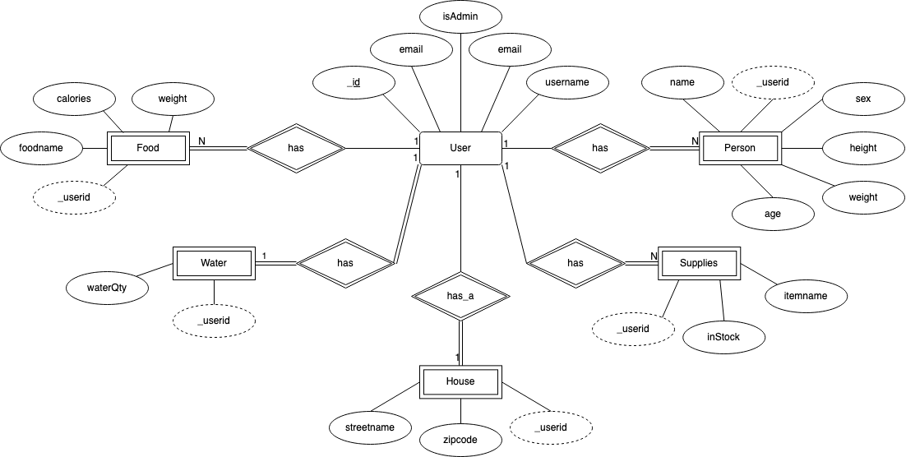

# Backend and Frontend Template

Latest version: https://git.chalmers.se/courses/dit342/group-00-web

This template refers to itself as `group-00-web`. In your project, use your group number in place of `00`.

## Project Structure

| File        | Purpose           | What you do?  |
| ------------- | ------------- | ----- |
| `server/` | Backend server code | All your server code |
| [server/README.md](server/README.md) | Everything about the server | **READ ME** carefully! |
| `client/` | Frontend client code | All your client code |
| [client/README.md](client/README.md) | Everything about the client | **READ ME** carefully! |
| [docs/DEPLOYMENT.md](docs/DEPLOYMENT.md) | Free online production deployment | Deploy your app online in production mode |
| [docs/LOCAL_DEPLOYMENT.md](docs/LOCAL_DEPLOYMENT.md) | Local production deployment | Deploy your app local in production mode |

## Requirements

The version numbers in brackets indicate the tested versions but feel free to use more recent versions.
You can also use alternative tools if you know how to configure them (e.g., Firefox instead of Chrome).

* [Git](https://git-scm.com/) (v2) => [installation instructions](https://www.atlassian.com/git/tutorials/install-git)
  * [Add your Git username and set your email](https://docs.gitlab.com/ce/gitlab-basics/start-using-git.html#add-your-git-username-and-set-your-email)
    * `git config --global user.name "YOUR_USERNAME"` => check `git config --global user.name`
    * `git config --global user.email "email@example.com"` => check `git config --global user.email`
  * > **Windows users**: We recommend to use the [Git Bash](https://www.atlassian.com/git/tutorials/git-bash) shell from your Git installation or the Bash shell from the [Windows Subsystem for Linux](https://docs.microsoft.com/en-us/windows/wsl/install-win10) to run all shell commands for this project.
* [Chalmers GitLab](https://git.chalmers.se/) => Login with your **Chalmers CID** choosing "Sign in with" **Chalmers Login**. (contact [support@chalmers.se](mailto:support@chalmers.se) if you don't have one)
  * DIT342 course group: https://git.chalmers.se/courses/dit342
  * [Setup SSH key with Gitlab](https://docs.gitlab.com/ee/ssh/)
    * Create an SSH key pair `ssh-keygen -t ed25519 -C "email@example.com"` (skip if you already have one)
    * Add your public SSH key to your Gitlab profile under https://git.chalmers.se/profile/keys
    * Make sure the email you use to commit is registered under https://git.chalmers.se/profile/emails
  * Checkout the [Backend-Frontend](https://git.chalmers.se/courses/dit342/group-00-web) template `git clone git@git.chalmers.se:courses/dit342/group-00-web.git`
* [Server Requirements](./server/README.md#Requirements)
* [Client Requirements](./client/README.md#Requirements)

## Getting started

```bash
# Clone repository
git clone git@git.chalmers.se:courses/dit342/group-00-web.git

# Change into the directory
cd group-00-web

# Setup backend
cd server && npm install
npm run dev

# Setup frontend
cd client && npm install
npm run serve
```

> Check out the detailed instructions for [backend](./server/README.md) and [frontend](./client/README.md).

## Visual Studio Code (VSCode)

Open the `server` and `client` in separate VSCode workspaces or open the combined [backend-frontend.code-workspace](./backend-frontend.code-workspace). Otherwise, workspace-specific settings don't work properly.

## System Definition (MS0)

### Purpose

Our system serves as a valuable tool for ensuring the availability of essential supplies within your household for potential emergencies. It effectively monitors your food and water inventory while allowing you to involve household members in your readiness plan. This data is presented in a structured and comprehensible manner, providing a precise overview of your readiness status.

### Pages

1. Login Page<br>
This page prompts the user to enter their credentials to log in or create a new account if they do not have one already.

2. Register Page<br>
This page prompts the user to type in a username, email, password and characteristics.

3. Main Page<br>
This page will display overviews of the users food and water. It will be structured as a dashboard so that the user can easily glance over their current preparedness. The page will also display a quote based on what the current status of preparedness is.

4. Household Members Page<br>
This page allows the user with the to manage their household members' information. You can add, update, or remove household members as needed, ensuring that your readiness plan always reflects your current family composition.

5. Food Page<br>
This page allows the user to curate personalized food inventory, enabling them to add, update, or remove food items they currently have in stock. 

6. Emergency Supplies Page<br>
This page allows the user to create personalized emergency supply list. While it provides a default set of items as a starting point, you have the freedom to add or remove supplies according to your specific needs. Each item comes with a toggle option, allowing you to easily mark whether you have it in stock at home or not.

7. Settings Page<br>
This page allows the user to change their password.

8. Admin page<br>
This page grants administrative access to view a comprehensive list of all entities within the system. Admins can delete specific entitities and users. When a user is deleted, the associated food items, household members, and supplies are also removed from the system.


### Entity-Relationship (ER) Diagram



## Teaser (MS3)


